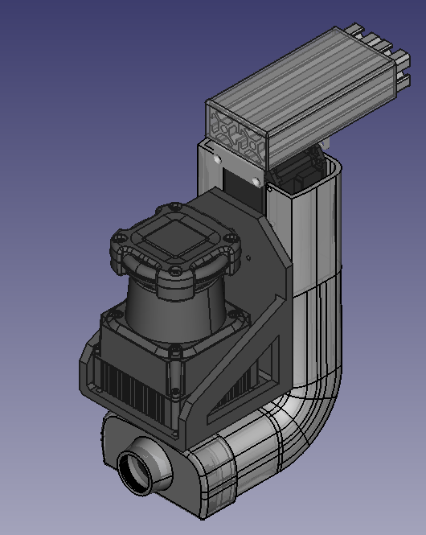

# 3D-mobile-mapping-unit

The mobile mapping unit is an advanced device designed to create precise 3D maps of various environments. It integrates multiple cutting-edge technologies, including an Inertial Measurement Unit (IMU), a high-resolution camera, a servo motor, and a LiDAR sensor. The IMU tracks the unit's orientation and movement, ensuring accurate spatial awareness. The high-resolution camera captures detailed visual information, complementing the spatial data provided by the LiDAR sensor. The servo motor allows for precise adjustment of the camera and LiDAR positioning, enabling comprehensive coverage and detailed scanning from multiple angles. By synchronizing the data from the IMU, camera, and LiDAR, the unit generates cohesive and detailed 3D representations of the environment. This integration ensures robust and reliable mapping, even in dynamic or challenging conditions. The mobile mapping unit is an invaluable tool for efficiently navigating and mapping complex environments, providing high-quality data for a variety of applications.

## IMU Calibrator GUI

